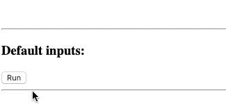

# ngx-autofocus-fix

<!-- BADGES -->
[](https://circleci.com/gh/korniychuk/angular-autofocus-fix/tree/master)
[](https://coveralls.io/r/korniychuk/angular-autofocus-fix?branch=master)
[](https://www.npmjs.com/package/ngx-autofocus-fix)

[](https://snyk.io/test/github/korniychuk/angular-autofocus-fix)
<!-- /BADGES -->

Angular 5+ directive for fix autofocus on dynamically created controls (`*ngIf`, `*ngFor`, etc.).  
[legacy version for Angular 2/4](https://github.com/korniychuk/angular-autofocus-fix/tree/legacy-version)

[Online Demo](https://stackblitz.com/edit/ngx-autofocus-fix-demo) (Stackblitz.com)



## Advantages over the other libraries

* **Uses native HTML attribute `autofocus` as the selector!** [example](#quick-start)
* There are no custom selectors, no need to change your HTML template.
* Works with native DOM. Doesn't use any dependencies(jQuery, lodash, etc.).
* [Configurable](#configuration). Use can use input attributes or provide global options via `AutofocusFixConfig`
* 100% Coverage, over 60 unit tests.
* E2E tests for 8,7,6 and 5 versions of Angular including e2e test for Angular Material Input.
* The library understands an extensive list of input data. (`null/NaN/'true'/[]/...`). See [Advanced examples](#advanced-examples)
* Supports asynchronous focusing(optionally wrapping `.focus()` execution with `setTimeout()`).
* Works perfectly with Angular Material. (there is an E2E test)
* Works with AOT mode. (tested via E2E test)

## Installation

Notice: npm package renamed `angular-autofocus-fix` -> `ngx-autofocus-fix`

To install this library, run:

```bash
$ npm i ngx-autofocus-fix --save
```
or
```bash
$ yarn add ngx-autofocus-fix
```

## Quick start

1. Import the library in your Angular application, for example in `AppModule`:

```typescript
import { BrowserModule } from '@angular/platform-browser';
import { NgModule } from '@angular/core';

import { AutofocusFixModule } from 'ngx-autofocus-fix'; // <--- new code

import { AppComponent } from './app.component';

@NgModule({
  declarations: [
    AppComponent,
  ],
  imports: [
    BrowserModule,

    AutofocusFixModule.forRoot(), // <--- new code
  ],
  providers: [],
  bootstrap: [ AppComponent ]
})
export class AppModule { }
```

2. You can now use autofocus directive in app.component.html

```html
<input autofocus
       placeholder="I have autofocus"
       *ngIf="showInput"
>
<button (click)="showInput = !showInput">Toggle Input</button>
```

## Advanced examples

Ways to **disable autofocus:** any js-falsy value, except an empty string (default `@Input`'s [normalization mode](#inputs-smart-empty-check-normalization-mode))

```html
   <!-- with data binding -->
   <input [autofocus]=""> <!-- undefined value -->
   <input [autofocus]="undefined">
   <input [autofocus]="false">
   <input [autofocus]="null">
   <input [autofocus]="0">
   <input [autofocus]="NaN">
   
   <!-- without data binding -->
   <input autofocus="undefined">
   <input autofocus="false">
   <input autofocus="null">
   <input autofocus="0">
   <input autofocus="NaN">
   
   <input> <!-- disabled by default -->
``` 

Ways to **enable autofocus:** any js-truthy value and an empty string (default `@Input`'s [normalization mode](#inputs-smart-empty-check-normalization-mode))

```html
   <!-- an empty string will enable autofocus, this is default HTML behavior -->
   <input [autofocus]="''">
   <input autofocus="">
   <input autofocus> <!-- this is an empty string too -->
   
   <input autofocus="autofocus">
   
   <input [autofocus]="true">
   <input [autofocus]="1">
   <input autofocus="true">
   
   <input [autofocus]="'any other values'">
   <input autofocus="any other values">

   <input [autofocus]="{}">
   <input [autofocus]="[]">
```

## Input's Smart Empty Check normalization mode

All input values are passed through the function: `normalizeInputAsBoolean(value: any, smartEmptyCheck = false): boolean`.

Smart Empty Check mode changes the behavior so that the following values are treated as falsy:
* An empty string `''`
* An empty object `{}`
* An empty array `[]`

See [Configuration](#configuration) to understand how to enable the mode.

**Notes:**
* Smart Empty Check normalization mode available only for `autofocus` attribute. All other directive `@Input`'s always works in the default normalization mode.
* Using attribute `autofocus` without any value doesn't enable autofocusing in Smart Empty Check mode. Because of an empty value means an empty string in terms of Angular templates syntax. 

## Configuration

### Options

```typescript
export class AutofocusFixConfig {
  ...

  /**
   * In case `true` .focus() events will be wrapped by `setTimeout(() => ...)`.
   *
   * Notice:
   * I'm not sure that the action is a good practice, however this ability added because of next issues:
   * - https://github.com/korniychuk/angular-autofocus-fix/issues/1
   * - https://github.com/spirosikmd/angular2-focus/issues/46
   */
  public readonly async: boolean = false;
  /**
   * In case `true`: treat an empty string, an empty array and an empty object as a falsy value.
   * In case `false`(default): each of these values treats as truthy.
   */
  public readonly smartEmptyCheck: boolean = false;
  /**
   * In case `true`: trigger {@link ChangeDetectorRef.detectChanges}() after {@link HTMLElement.focus}().
   *
   * This is helpful in the case when the HTMLElement to which {@link AutofocusFixDirective} added
   * wrapped by another directive/component that has some binding related to focus of the element.
   * In this case without enabling .triggerChangeDetection option Angular throws ExpressionChangedAfterItHasBeenCheckedError.
   *
   * A striking example is the <mat-form-field> from the Angular Material that wraps <input> control.
   */
  public readonly triggerDetectChanges: boolean = false;
}
```

### There are four ways to configure the `AutofocusFixDirective`:

**1. Specify attribute-options for specific HTML Element**
   ```html
   <input type="text"
          autofocus
          autofocusFixAsync
          autofocusFixSmartEmptyCheck
          autofocusFixTriggerDetectChanges
   >
   ```
   [Normalization](#inputs-smart-empty-check-normalization-mode)(only default) available and binding supported.
   ```html
   <input type="text"
          autofocus
          [autofocusFixAsync]="true"
          [autofocusFixSmartEmptyCheck]="true"
          [autofocusFixTriggerDetectChanges]="true"
   >

   <input type="text"
          autofocus
          autofocusFixAsync="true"
          [autofocusFixSmartEmptyCheck]="isSmart"
          autofocusFixTriggerDetectChanges="a truthy value"
   >
   ```

**2. Specify global options for the whole application by passing it to `.forRoot({ ... })`**
  ```typescript
  @NgModule({
    ...
    imports: [
      ...
      AutofocusFixModule.forRoot({
        async: true,
        smartEmptyCheck: true,
        triggerDetectChanges: true,
      }),
    ],
    ...
  })
  export class AppModule { }
  ```

**3. Provide Lazy-Route level `AutofocusFixConfig` config**

  ```typescript
  import { NgModule } from '@angular/core';
  import { AutofocusFixModule, AutofocusFixConfig } from 'ngx-autofocus-fix';


  const autofocusFixConfigProvider: Provider = {
    provide: AutofocusFixConfig,
    useValue: new AutofocusFixConfig({
      async: true,
      smartEmptyCheck: true,
      triggerDetectChanges: true,
    }),
  };

  @NgModule({
    ...
    imports: [
      ...
      AutofocusFixModule,
    ],
    providers: [ autofocusFixConfigProvider ],
  })
  export class MyLazyLoadableModule { }
  ```

**4. Provide Component level `AutofocusFixConfig` config**
  ```typescript
  import { Component, Provider } from '@angular/core';
  import { AutofocusFixConfig } from 'ngx-autofocus-fix';

  const autofocusFixConfigProvider: Provider = {
    provide: AutofocusFixConfig,
    useValue: new AutofocusFixConfig({
      async: true,
      smartEmptyCheck: true,
      triggerDetectChanges: true,
    }),
  };

  @Component({
    ...
    providers: [ autofocusFixConfigProvider ],
  })
  export class MyComponent {}
  ```


## Development

Build the library:

```bash
$ npm run build
```

Publish the library:

```bash
cd dist/ngx-autofocus-fix
npm publish
```

To lint all `*.ts` files:

```bash
$ npm run lint
```

To run library unit-tests:

```bash
$ npm run test-lib
```

To run e2e tests:

```bash
$ npm run e2e -- --prod=true
```

To run local dev server [http://localhost:4200](http://localhost:4200):

```bash
$ npm start
$ npm run serve:prod -- angular-8-test # AoT & Prod env
```

## Author

| [<br /><sub>Anton Korniychuk</sub>](https://korniychuk.pro) |
| :---: |
